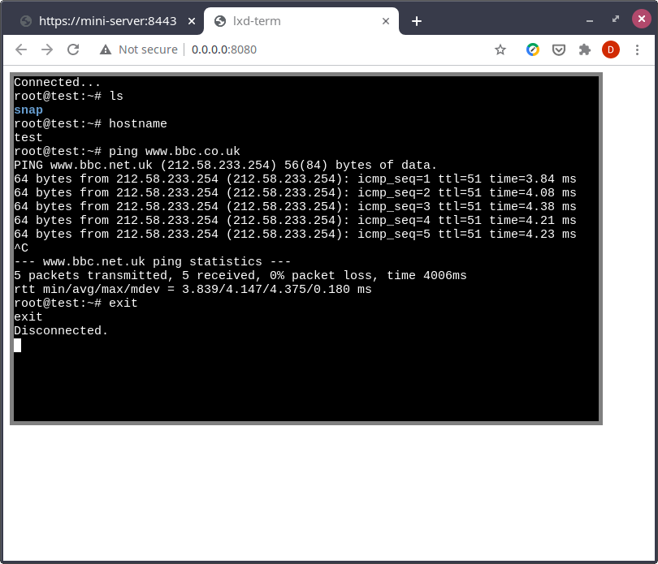

# lxd-term

Simple hacked together example of getting an interactive shell in a container. 
Using pylxd, web.py and xterm.js.

Endpoint, container and shell need to be manually edited in `lxd-term.py` to the 
respective values for your setup.

All browsers will decline the self-signed certificate for lxd so you either 
need to import it or go to the https endpoint in your browser and accept the 
certificate. Leave this open in a tab then open the terminal in another tab 
in the same window and it should work.

